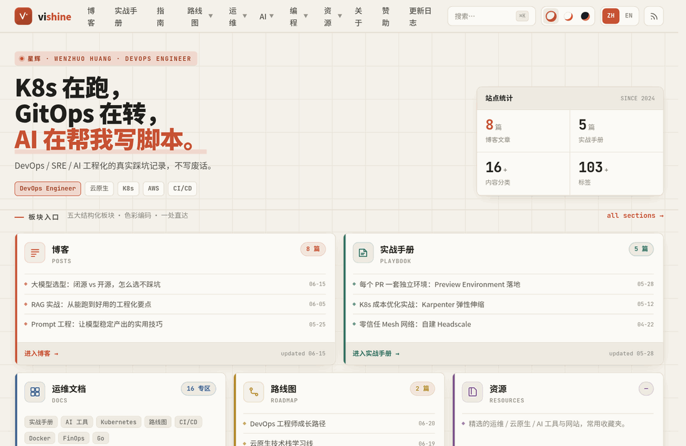
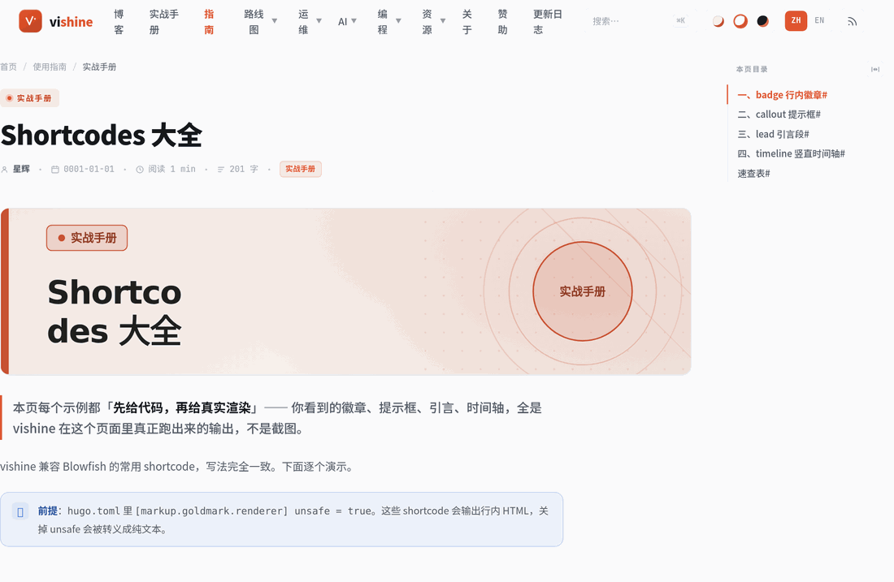
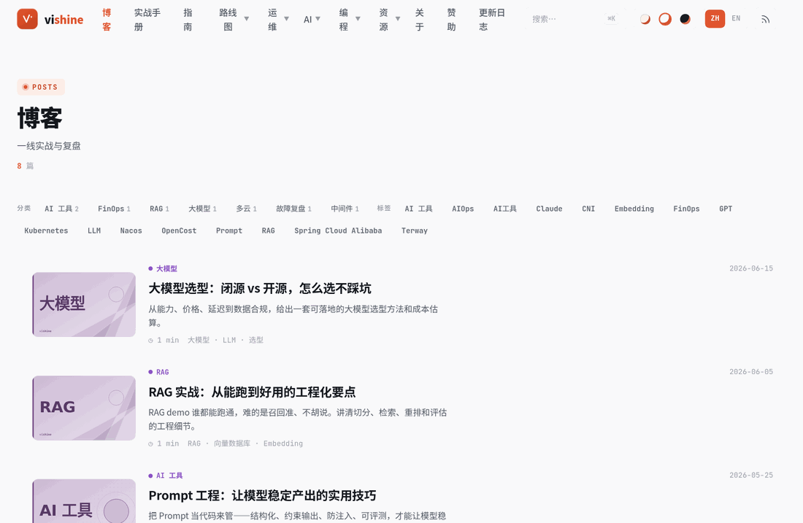
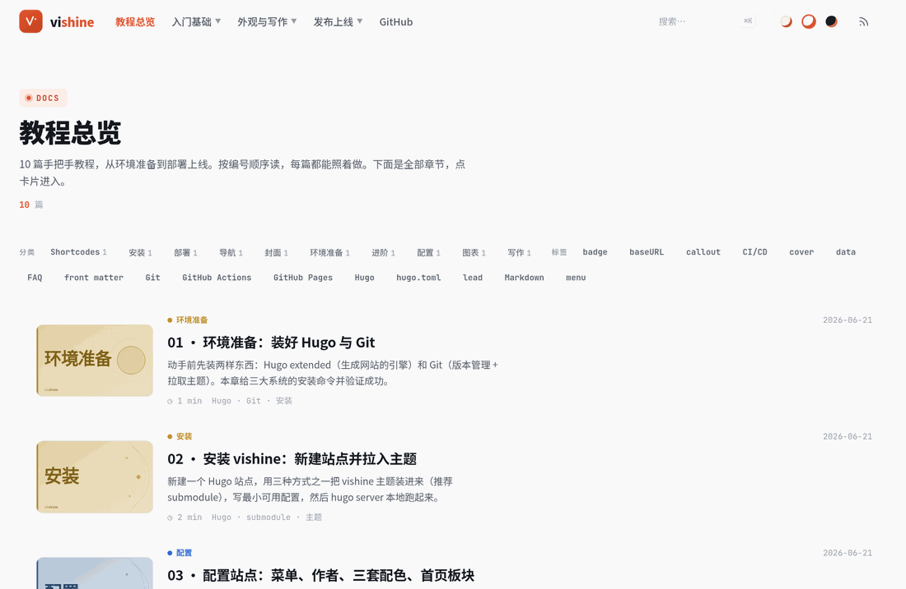
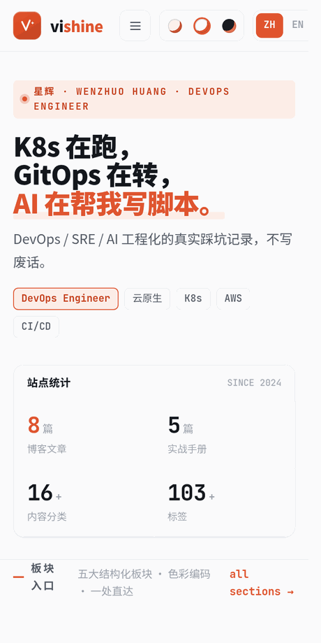
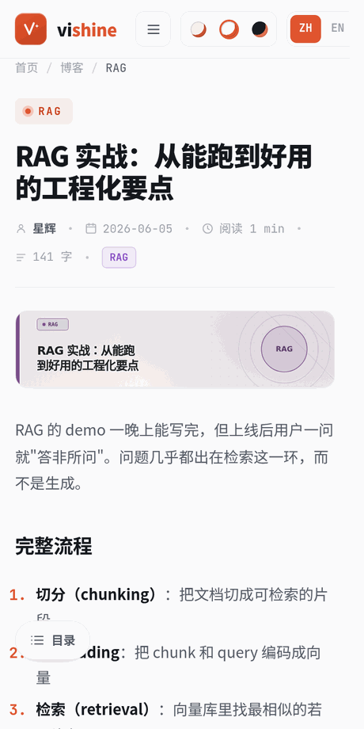
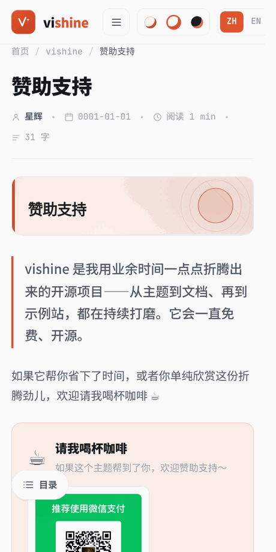

# vishine

> ナレッジポータル型の中国語技術ブログ向け Hugo テーマ —— DevOps / クラウドネイティブ / AI エンジニアリングの長期的な執筆のために。

[](./LICENSE)
[](https://gohugo.io/)
[](#)
[](https://blowfish.page/)

**[オンラインデモ](https://socake.github.io/vishine/)** · **[チュートリアルサイト](https://socake.github.io/vishine/tutorial/)** · **[使用ドキュメント](docs/USAGE.md)** · **[クイックスタート](docs/GETTING-STARTED.md)**

🌐 [中文](README.md) · [English](README.en.md) · **日本語**

---

## なぜもう一つテーマを作るのか

技術ブログを書き始めて数年、トラブル対応のメモが200本以上たまりました。ずっと [Blowfish](https://blowfish.page/) を使ってきました —— とても良いテーマですが、いつも何かもう一歩足りないと感じていました。

私が欲しかったのは単なる「ブログ一覧」ではなく、**ブログ / 実戦マニュアル / ロードマップ / ドキュメント / リソース**をすべて編成できる**ナレッジポータル**でした。コンテンツをセクションごとに自動で色分けし、これがトラブル実録なのか成長ロードマップなのかを読者が一目で見分けられるようにしたかった。記事に画像がなくても、灰色のプレースホルダーの羅列ではなく、見栄えのするカバー画像を持たせたかった。そして中国語の読み心地をもっと滑らかにしたかった —— 字間、行高、コードブロック、目次ツリー、そのどれもが真剣に書いた文章にふさわしいものであってほしかったのです。

そうして vishine が生まれました。Blowfish の肩の上に立ち、カラーコード化されたセクション体系、bento スタイルのポータルトップページ、純粋に Hugo ネイティブな自動カバー生成器、⌘K コマンドパレット検索……を加えました。本質的には、「自分が毎日使いたいと思うブログ」を、誰でも使えるテーマに仕立て上げたものです。

あなたも真剣に技術ブログを書いているなら、これがお役に立てば幸いです。

---

## スクリーンショット

### 🖥 デスクトップ

| トップページ（bento ポータル） | 記事ページ + 目次ツリー | 左画像・右テキストの一覧 |
| :---: | :---: | :---: |
|  |  |  |
| **⌘K コマンドパレット** | **ダークテーマ** | **暖紙（ペーパー）テーマ** |
|  |  |  |
| **Shortcodes デモ** | **自動カバー（4レイアウト）** | **チュートリアルサイト** |
|  |  |  |

### 📱 モバイル

| トップページ | 記事ページ | スポンサーページ | ドロワーメニュー |
| :---: | :---: | :---: | :---: |
|  |  |  |  |

---

## 特徴

**ビジュアルとカラースキーム**
- 切り替え可能な3つのカラースキーム：暖紙 `paper` / 純白 `clean` / ダーク `dark`。グローバルな CSS トークンでワンクリック切り替え、`localStorage` で永続化、レンダリング前にインラインで適用するためチラつきなし。
- 5大セクションのカラーコード化：コンテンツをセクション（ブログ / 実戦マニュアル / ロードマップ / 運用ドキュメント / リソース）ごとに色分けし、カテゴリをセクション色にマッピング可能。サイト全体を一箇所で設定（`data/sections.toml`）。
- bento スタイルのナレッジポータルトップページ：モジュール化されたカードグリッドで、異なるセクションの最新コンテンツを一目瞭然なポータルに編成。

**コンテンツの表示**
- 左画像・右テキストの feed 一覧：カテゴリ / タグによる即時フィルタリング + もっと読み込む。
- 自動カバー生成器：記事に画像がない場合、「タイトル + カテゴリ」からカバーを自動生成。4種類のレイアウト（orbit / grid / diagonal / arc）をハッシュに応じてローテーションし、セクション色で着色。**純粋に Hugo ネイティブで、外部依存はゼロ**。`[params.cover]` でスタイル調整、レイアウト固定、オフ化が可能。

**インタラクションとナビゲーション**
- ⌘K コマンドパレット検索：サイト全体のタイトル / 概要 / カテゴリ / タグを検索。
- 折りたたみ可能な目次ツリー + 読書進捗バー、scrollspy ハイライト。
- ヘッダーの多階層ドロップダウンメニュー：`identifier` の親項目 + `parent` の子項目。
- レスポンシブ + アクセシビリティ対応：モバイルのドロワーナビゲーション、`prefers-reduced-motion` 対応、キーボード操作可能。

**執筆機能**
- Mermaid のセルフホスト：` ```mermaid ` フェンスで自動レンダリング、カラースキームに合わせて色を反転、**CDN に依存せず**、社内ネットワーク / オフラインでも利用可能。
- Blowfish 互換の shortcodes：`badge` / `lead` / `callout` / `typeit` / `timeline` / `sponsor`。
- コードブロックのワンクリックコピー、画像の自動 `figure` 化 + クリックで拡大、超ワイドなビットマップの自動縮小。
- 多言語 i18n：UI テキストに**26言語**を内蔵（中 / 英 / 日 / 韓 / 仏 / 独 / 西 / 葡 / 露 / 阿 / 繁体中…）。ヘッダーからワンクリックで切り替え、さらに拡張可能。

---

## 2つのサンプルサイト

| サイト | 何か | アドレス |
| --- | --- | --- |
| **完成版デモ** | サンプル記事を入れた完全なブログ。テーマの実際の姿を示す | [socake.github.io/vishine](https://socake.github.io/vishine/) |
| **チュートリアルサイト** | テーマ自身でレンダリングした一連のハンズオンチュートリアル。Hugo のインストールからデプロイ公開まで | [socake.github.io/vishine/tutorial](https://socake.github.io/vishine/tutorial/) |

初心者は**チュートリアルサイト**から始めるのがおすすめです。一歩ずつテーマの使い方を案内してくれます。

---

## クイックスタート

### 1. テーマのインストール

```bash
# 方法 A：Git submodule（推奨、後の更新が楽）
git submodule add https://github.com/socake/vishine.git themes/vishine

# 方法 B：直接クローン
git clone https://github.com/socake/vishine.git themes/vishine
```

### 2. 最小限の `hugo.toml`

> ⚠ が付いているブロックは**抜けると壊れる**ものなので、必ずそのままコピーしてください。コメント付きの完全版は [`exampleSite/hugo.toml`](exampleSite/hugo.toml) を参照。

```toml
baseURL = "https://example.org/"
title   = "我的博客"
theme   = "vishine"
defaultContentLanguage = "zh-cn"   # ⚠ 中国語テーマなので必ず設定すること
enableEmoji = true

[pagination]
  pagerSize = 8

# ⚠ 必須：タクソノミー。セクション色のマッピング、フィルタリング、トップページの統計はこれに依存
[taxonomies]
  tag = "tags"
  category = "categories"

# ⚠⚠ 最もハマりやすい：JSON を抜かすと ⌘K 検索の /index.json が 404 になり、検索が無言で失敗する
[outputs]
  home = ["HTML", "RSS", "JSON"]

# ⚠ 必須：render hook はこれらの goldmark / highlight 設定に依存
[markup]
  [markup.goldmark.renderer]
    unsafe = true            # ⚠ shortcode がインライン HTML を出力するために必要
  [markup.goldmark.parser]
    autoHeadingID = true
    [markup.goldmark.parser.attribute]
      title = true
      block = true
  [markup.highlight]
    noClasses = false
  [markup.tableOfContents]
    startLevel = 2
    endLevel = 3

[menu]
  [[menu.main]]
    name = "博客"
    pageRef = "/posts"
    weight = 10

[params]
  author = "你的名字"
  defaultScheme = "clean"   # paper / clean / dark
```

### 3. 起動

```bash
hugo server -D
```

ブラウザで `http://localhost:1313/` を開きます。どこかで詰まりましたか？[チュートリアルサイト](https://socake.github.io/vishine/tutorial/)に、より詳しい図解付きの手順があります。

---

## 設定クイックビュー

> 以下はあくまで概観です。各項目の完全な説明は [`docs/USAGE.md`](docs/USAGE.md) と[チュートリアルサイト](https://socake.github.io/vishine/tutorial/)にあります。

### セクションのカラーコード化

テーマには5大セクション色（`blog` / `play` / `road` / `docs` / `res`、加えて `ai` の赤）がプリセットされています。**カテゴリ名**をセクション class にマッピングすることで、カード / タグ / 自動カバーの色が決まります。自分のサイトの `data/sections.toml` で設定します：

```toml
[categories]
  "Kubernetes" = "docs"
  "云原生"      = "play"
  "FinOps"     = "road"
  "大模型"      = "res"
  "故障复盘"    = "ai"
```

マッチしなかったカテゴリは、所属する section のセクション色に自動的にフォールバックし、最終的には `blog` にフォールバックします。

### 自動カバー

記事に `featured.*` リソースがなく、frontmatter の `cover` もない場合、カバーを自動生成します：

```toml
[params.cover]
  auto  = true        # false = オフにし、featured 画像のみに頼る
  style = "auto"      # auto（ハッシュで4レイアウトをローテーション）| orbit | grid | diagonal | arc
  # ignoreFeatured = false   # true = featured 画像があっても強制的に自動カバーを使う（移行時のスタイル変更に便利）
```

### ヘッダーの多階層ドロップダウンメニュー

親項目に `identifier` を使い、子項目を `parent` でぶら下げると、ドロップダウンになります：

```toml
[[menu.main]]
  name = "运维"
  identifier = "ops"
  weight = 40
[[menu.main]]
  name = "Kubernetes"
  parent = "ops"
  pageRef = "/docs/kubernetes"
  weight = 41
```

---

## 組み込み Shortcodes

| Shortcode | 使い方 | 説明 |
| --- | --- | --- |
| `badge` | `内容` | インラインの小さなバッジ |
| `lead` | `导语` | 文頭のリード段落 |
| `callout` | `…` | 注意ボックス（デフォルトは `info`） |
| `typeit` | `文本` | 目を引く引用ブロック |
| `timeline` | 各行に `ノード \| ステージ \| キーワード` | 縦型タイムライン / ロードマップ |
| `sponsor` | `` | スポンサー / 投げ銭エリア（収款コードは `params.sponsor` で設定） |

`mermaid` 図は ` ```mermaid ` フェンスで記述します。自動レンダリングされ、カラースキームに合わせて色が反転し、セルフホストで CDN に依存しません。

---

## ドキュメント索引

| ドキュメント | 内容 |
| --- | --- |
| [チュートリアルサイト](https://socake.github.io/vishine/tutorial/) | ハンズオンの図解チュートリアル（Hugo のインストールからデプロイ公開まで、初心者に最適） |
| [`docs/GETTING-STARTED.md`](docs/GETTING-STARTED.md) | ゼロから公開までのクイックガイド |
| [`docs/USAGE.md`](docs/USAGE.md) | 詳細な使用ドキュメント（設定の項目別解説、執筆、トラブル対応、FAQ） |
| [`docs/DESIGN.md`](docs/DESIGN.md) | デザインシステム（カラートークン、セクション色、コンポーネント、レイアウト） |
| [`docs/INTERACTION.md`](docs/INTERACTION.md) | インタラクション仕様 |
| [`docs/MARKDOWN.md`](docs/MARKDOWN.md) | Markdown レンダリング仕様 |
| [`CONTRIBUTING.md`](CONTRIBUTING.md) | コントリビューションガイド |

---

## スポンサー

vishine は余暇の時間を使って少しずつ作り上げてきたもので、ドキュメントやサンプルサイトも継続的に充実させています。もしこれがあなたの時間を節約できたなら、あるいは単純にこの作り込みへの情熱を気に入ってくれたなら、コーヒーを一杯おごっていただけると嬉しいです ☕

<table>
  <tr>
    <td align="center"><br><b>WeChat</b></td>
    <td align="center"><br><b>Alipay</b></td>
  </tr>
</table>

あなたの一つひとつの支援が、私がメンテナンスを続け、ドキュメントを書き続けるための原動力になります。

---

## Star History

このプロジェクトがお役に立てたなら、Star を付けていただくのが私への最も直接的な励みになります ⭐

[](https://star-history.com/#socake/vishine&Date)

---

## 謝辞

vishine は **[Blowfish](https://github.com/nunocoracao/blowfish)**（© Nuno Coração、MIT）から二次開発したもので、原作者のクレジットを保持しています。Blowfish が提供してくれた堅実な土台と優れた shortcodes の設計に感謝します —— それがなければ、vishine は存在しませんでした。

---

## License

本テーマは **[MIT License](./LICENSE)** で公開されており、著作権は © 2024-2026 Xinghui（星輝, Wenzhuo Huang）に帰属します。

> オープンソースなのは**テーマ**そのものです。`exampleSite/` とチュートリアルサイトはあくまでデモであり、実際のブログ記事は**一切含みません**。

---

**Xinghui（星輝, Wenzhuo Huang）** が愛を込めて作りました · [github.com/socake/vishine](https://github.com/socake/vishine)
