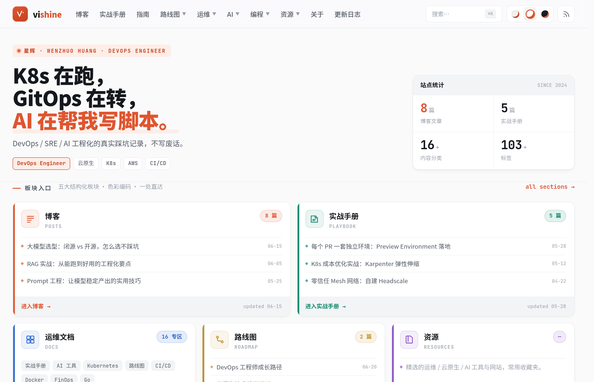
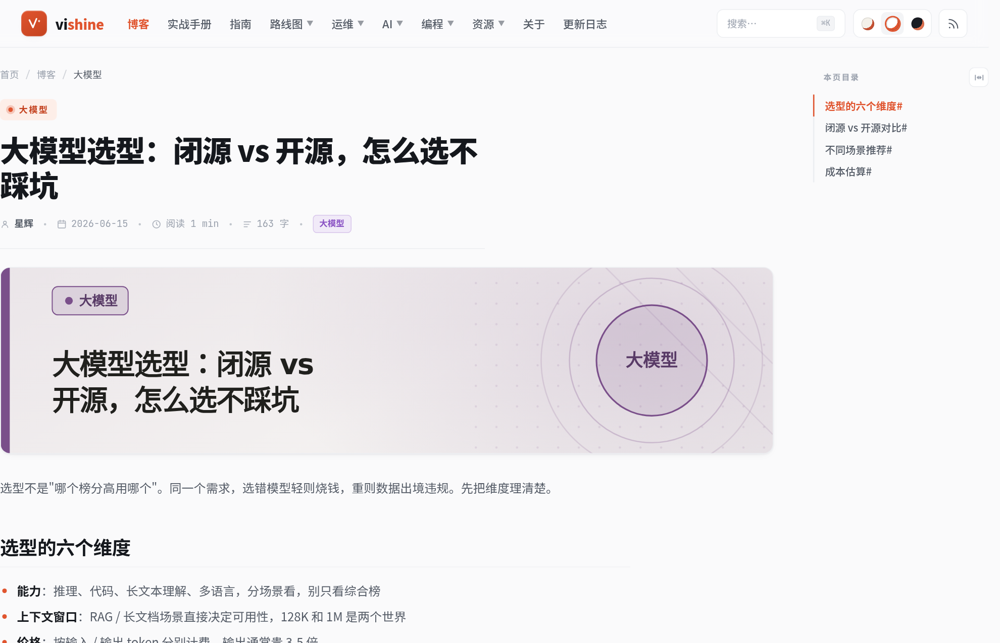
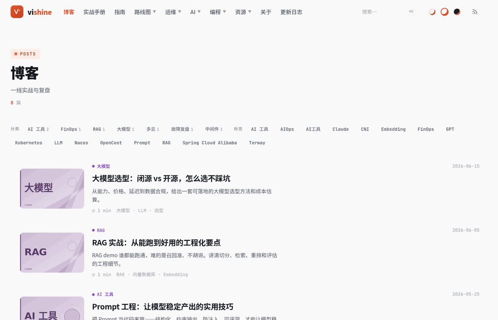
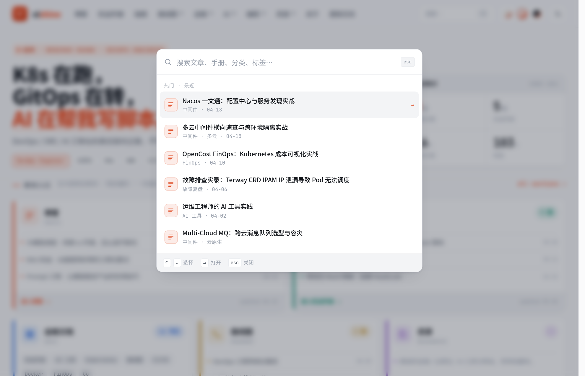
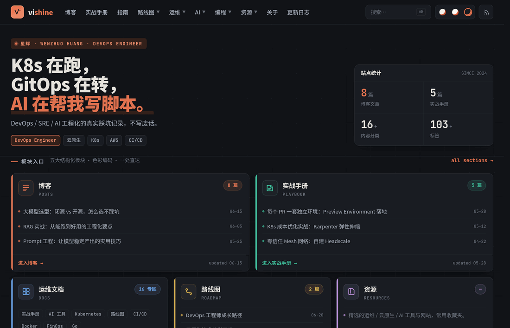
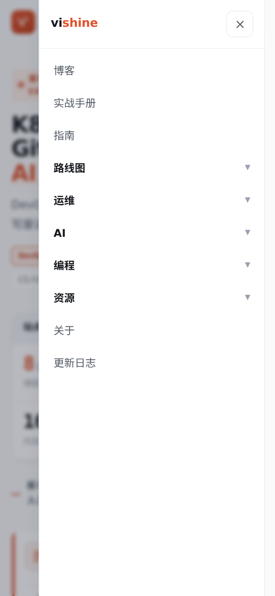

# vishine

> 知识门户型的中文技术博客 Hugo 主题 —— 为 DevOps / 云原生 / AI 工程化的长期写作而生。

[](./LICENSE)
[](https://gohugo.io/)
[](#)
[](https://blowfish.page/)

**[在线 Demo](https://socake.github.io/vishine/)** · **[教程文档站](https://socake.github.io/vishine/tutorial/)** · **[使用文档](docs/USAGE.md)** · **[快速开始](docs/GETTING-STARTED.md)**

---

## 为什么又造一个轮子

我写技术博客好几年了，攒下两百多篇踩坑笔记。一直用 [Blowfish](https://blowfish.page/) —— 很好的主题，但总觉得差一口气：

我想要的不是一个「博客列表」，而是一个能把**博客 / 实战手册 / 路线图 / 文档 / 资源**都编排进去的**知识门户**；我想要内容能按板块自动着色，让读者一眼分清这是踩坑实录还是成长路线；我想要文章不配图也能有一张体面的封面，而不是一排灰扑扑的占位框；我还想要中文的阅读体验再顺一点——字距、行高、代码块、目录树，每一处都对得起认真写的字。

于是有了 vishine。它站在 Blowfish 的肩膀上，加了一套色彩编码的板块体系、bento 门户首页、纯 Hugo 原生的自动封面生成器、⌘K 命令面板搜索……本质上，是把「我自己每天想用的那个博客」做成了一个谁都能拿去用的主题。

如果你也在认真写技术博客，希望它能帮上忙。

---

## 截图

| 首页（bento 门户） | 文章页 + 目录树 | 左图右文列表 |
| :---: | :---: | :---: |
|  |  |  |
| **⌘K 命令面板** | **暗色配色** | **移动端抽屉** |
|  |  |  |

---

## 特性

**视觉与配色**
- 三套可切换配色：暖纸 `paper` / 纯白 `clean` / 暗色 `dark`，全局 CSS token 一键切换，`localStorage` 持久化，渲染前内联应用、无闪烁。
- 五大板块色彩编码：内容按板块（博客 / 实战手册 / 路线图 / 运维文档 / 资源）着色，分类可映射到板块色，全站一处配置（`data/sections.toml`）。
- bento 风格知识门户首页：模块化卡片网格，把不同板块的最新内容编排成一目了然的门户。

**内容呈现**
- 左图右文 feed 列表：分类 / 标签即时筛选 + 加载更多。
- 自动封面生成器：文章无图时按「标题 + 分类」自动生成封面，4 种版式（orbit / grid / diagonal / arc）据哈希轮换、板块色着色，**纯 Hugo 原生、零外部依赖**；`[params.cover]` 可调风格、可锁定版式、可关闭。

**交互与导航**
- ⌘K 命令面板搜索：全站搜索标题 / 摘要 / 分类 / 标签。
- 可折叠目录树 + 阅读进度条，scrollspy 高亮。
- 顶栏多级下拉菜单：`identifier` 父项 + `parent` 子项。
- 响应式 + 无障碍：移动端抽屉导航、`prefers-reduced-motion` 适配、键盘可达。

**写作能力**
- Mermaid 自托管：用 ` ```mermaid ` 围栏自动渲染，随配色翻色，**不依赖 CDN**，内网 / 离线可用。
- Blowfish 兼容 shortcodes：`badge` / `lead` / `callout` / `typeit` / `timeline` / `sponsor`。
- 代码块一键复制、图片自动 `figure` + 点击放大、超宽位图自动缩放。
- 多语言 i18n：界面文案中英完整，可扩展更多语言。

---

## 两个示例站

| 站点 | 是什么 | 地址 |
| --- | --- | --- |
| **成品 Demo** | 填了示例文章的完整博客，展示主题真实长相 | [socake.github.io/vishine](https://socake.github.io/vishine/) |
| **教程文档站** | 用主题本身渲染的一整套手把手教程，从装 Hugo 到部署上线 | [socake.github.io/vishine/tutorial](https://socake.github.io/vishine/tutorial/) |

新手建议从**教程文档站**开始，它会一步步带你把主题用起来。

---

## 快速开始

### 1. 安装主题

```bash
# 方式 A：Git submodule（推荐，方便后续更新）
git submodule add https://github.com/socake/vishine.git themes/vishine

# 方式 B：直接克隆
git clone https://github.com/socake/vishine.git themes/vishine
```

### 2. 最小可用 `hugo.toml`

> 带 ⚠ 的几块是**漏了就会坏**的，务必照抄。完整带注释版见 [`exampleSite/hugo.toml`](exampleSite/hugo.toml)。

```toml
baseURL = "https://example.org/"
title   = "我的博客"
theme   = "vishine"
defaultContentLanguage = "zh-cn"   # ⚠ 中文主题，务必设置
enableEmoji = true

[pagination]
  pagerSize = 8

# ⚠ 必需：分类法。板块色映射、筛选、首页统计都依赖它
[taxonomies]
  tag = "tags"
  category = "categories"

# ⚠⚠ 最易踩：漏掉 JSON，⌘K 搜索的 /index.json 会 404，搜索静默失效
[outputs]
  home = ["HTML", "RSS", "JSON"]

# ⚠ 必需：render hook 依赖这些 goldmark / highlight 设置
[markup]
  [markup.goldmark.renderer]
    unsafe = true            # ⚠ shortcode 输出行内 HTML 需要
  [markup.goldmark.parser]
    autoHeadingID = true
    [markup.goldmark.parser.attribute]
      title = true
      block = true
  [markup.highlight]
    noClasses = false
  [markup.tableOfContents]
    startLevel = 2
    endLevel = 3

[menu]
  [[menu.main]]
    name = "博客"
    pageRef = "/posts"
    weight = 10

[params]
  author = "你的名字"
  defaultScheme = "clean"   # paper / clean / dark
```

### 3. 启动

```bash
hugo server -D
```

浏览器打开 `http://localhost:1313/`。卡在哪了？[教程文档站](https://socake.github.io/vishine/tutorial/)有更详细的图文步骤。

---

## 配置速览

> 下面只是快览，每一项的完整说明都在 [`docs/USAGE.md`](docs/USAGE.md) 和[教程站](https://socake.github.io/vishine/tutorial/)里。

### 板块色彩编码

主题预设五大板块色（`blog` / `play` / `road` / `docs` / `res`，另有 `ai` 红）。把**分类名**映射到板块 class，决定卡片 / 标签 / 自动封面的颜色，在你自己站点的 `data/sections.toml` 配置：

```toml
[categories]
  "Kubernetes" = "docs"
  "云原生"      = "play"
  "FinOps"     = "road"
  "大模型"      = "res"
  "故障复盘"    = "ai"
```

未命中的分类自动回退到所属 section 的板块色，兜底 `blog`。

### 自动封面

文章无 `featured.*` 资源、无 frontmatter `cover` 时自动生成封面：

```toml
[params.cover]
  auto  = true        # false = 关闭，纯靠 featured 图
  style = "auto"      # auto（哈希轮换4版式）| orbit | grid | diagonal | arc
  # ignoreFeatured = false   # true = 即使有 featured 图也强制用自动封面（迁移换风格时好用）
```

### 顶栏多级下拉菜单

父项用 `identifier`，子项用 `parent` 挂载，即成下拉：

```toml
[[menu.main]]
  name = "运维"
  identifier = "ops"
  weight = 40
[[menu.main]]
  name = "Kubernetes"
  parent = "ops"
  pageRef = "/docs/kubernetes"
  weight = 41
```

---

## 内置 Shortcodes

| Shortcode | 用法 | 说明 |
| --- | --- | --- |
| `badge` | `内容` | 行内小徽章 |
| `lead` | `导语` | 文首导语段 |
| `callout` | `…` | 提示框（默认 `info`） |
| `typeit` | `文本` | 醒目引言块 |
| `timeline` | 每行 `节点 \| 阶段 \| 关键词` | 竖直时间轴 / 路线图 |
| `sponsor` | `` | 赞助 / 打赏区（收款码走 `params.sponsor` 配置） |

`mermaid` 图表用 ` ```mermaid ` 围栏书写，自动渲染、随配色翻色、自托管不依赖 CDN。

---

## 文档索引

| 文档 | 内容 |
| --- | --- |
| [教程文档站](https://socake.github.io/vishine/tutorial/) | 手把手图文教程（从装 Hugo 到部署上线，新手首选） |
| [`docs/GETTING-STARTED.md`](docs/GETTING-STARTED.md) | 从零到上线的快速指引 |
| [`docs/USAGE.md`](docs/USAGE.md) | 详细使用文档（配置逐项说明、写作、排坑、FAQ） |
| [`docs/DESIGN.md`](docs/DESIGN.md) | 设计系统（配色 token、板块色、组件、布局） |
| [`docs/INTERACTION.md`](docs/INTERACTION.md) | 交互规范 |
| [`docs/MARKDOWN.md`](docs/MARKDOWN.md) | Markdown 渲染规范 |
| [`CONTRIBUTING.md`](CONTRIBUTING.md) | 贡献指南 |

---

## 赞助

vishine 是我用业余时间一点点折腾出来的，文档和示例站也都在持续补。如果它帮你省下了时间，或者你单纯欣赏这份折腾劲儿，欢迎请我喝杯咖啡 ☕

<table>
  <tr>
    <td align="center"><br><b>微信</b></td>
    <td align="center"><br><b>支付宝</b></td>
  </tr>
</table>

你的每一份支持，都会变成我继续维护、继续写文档的动力。

---

## Star History

如果这个项目对你有用，点个 Star 是对我最直接的鼓励 ⭐

[](https://star-history.com/#socake/vishine&Date)

---

## 致谢

vishine 二次开发自 **[Blowfish](https://github.com/nunocoracao/blowfish)**（© Nuno Coração，MIT），保留原作者归属。感谢 Blowfish 提供的坚实基座与优秀的 shortcodes 设计——没有它，就没有 vishine。

---

## License

本主题以 **[MIT License](./LICENSE)** 发布，版权所有 © 2024-2026 星辉 (Wenzhuo Huang)。

> 开源的是**主题**本身；`exampleSite/` 与教程站仅为演示，**不含**任何真实博客文章。

---

由 **星辉 (Wenzhuo Huang)** 用爱发电 · [github.com/socake/vishine](https://github.com/socake/vishine)
