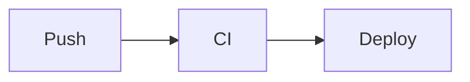

# 从零到上线：vishine 快速指引

这篇带你从一个空目录开始，到一个跑在 GitHub Pages 上的 vishine 中文技术博客。全程照着做即可，每一步都说清「为什么」。

更细的逐项配置参考 [`USAGE.md`](./USAGE.md)；视觉与交互规范见 [`DESIGN.md`](./DESIGN.md) / [`INTERACTION.md`](./INTERACTION.md) / [`MARKDOWN.md`](./MARKDOWN.md)。示例站点本身就是一套可浏览的教程，见 `exampleSite/content/guide/`。

---

## 0. 环境准备

vishine 用到 Hugo 的资源处理管线（图片缩放、SVG 内联封面、CSS/JS 指纹），**必须用 Hugo extended 版**。

```bash
hugo version
# 需要看到 extended，且版本 ≥ 0.146.0：
# hugo v0.146.0+extended ...
```

没装或不是 extended：

- macOS：`brew install hugo`
- Windows：`winget install Hugo.Hugo.Extended` 或 `scoop install hugo-extended`
- Linux：从 [Hugo Releases](https://github.com/gohugoio/hugo/releases) 下 `hugo_extended_*` 包

还需要 `git`。

---

## 1. 新建站点 + 安装主题

```bash
hugo new site myblog
cd myblog
git init

# 推荐用 submodule，方便后续升级
git submodule add https://github.com/socake/vishine.git themes/vishine
```

> 升级主题：`git submodule update --remote`。也可以直接 `git clone` 或用 Hugo Module，详见 USAGE §1。

---

## 2. 最小可用配置

删掉自动生成的 `hugo.toml`，换成下面这份。它只含**让主题正常工作的必需项**，注释标了每行作用。

```toml
baseURL = "https://example.org/"
title   = "我的博客"
theme   = "vishine"
defaultContentLanguage = "zh-cn"     # 必需
enableEmoji = true

# 必需：板块色 / 列表筛选 / 首页统计都依赖分类法
[taxonomies]
  tag = "tags"
  category = "categories"

# 必需：home 含 JSON，⌘K 命令面板搜索才有数据源
[outputs]
  home = ["HTML", "RSS", "JSON"]

[params]
  author = "星辉"
  authorEn = "Wenzhuo Huang"
  tagline = "把想法写下来，把踩的坑记下来。"
  defaultScheme = "clean"            # paper / clean / dark
  [params.cover]
    auto = true                      # 无 featured 图时自动生成封面

# render hook（标题锚点、代码复制、图片 zoom、shortcode）依赖以下设置
[markup]
  [markup.goldmark.renderer]
    unsafe = true                    # shortcode 输出行内 HTML（badge 等）需要
  [markup.goldmark.parser]
    autoHeadingID = true             # TOC / 锚点必需
  [markup.highlight]
    noClasses = false                # 代码高亮随三套 scheme 翻色

# 顶栏导航（不配则没有菜单）
[menu]
  [[menu.main]]
    name = "博客"
    pageRef = "/posts"
    weight = 10
  [[menu.main]]
    name = "关于"
    pageRef = "/about"
    weight = 80
```

### 三件「漏了就坏」的事

1. **`[outputs] home` 必须含 `JSON`** —— 否则 `/index.json` 404，⌘K 搜索打开了却搜不到任何东西，**且没有任何报错**，最难排查。
2. **`[taxonomies]` 必须有 `tag` / `category`** —— 否则板块色、筛选、统计全坏。
3. **`[markup.highlight] noClasses = false`** —— 否则代码高亮不随 paper/clean/dark 三套配色换色。

---

## 3. 配板块色（可选但推荐）

vishine 给五大内容板块各分配一个语义色，卡片、标签、自动封面都据此着色。着色逻辑是：**文章首个分类 → 查 `data/sections.toml` 的 `[categories]` 表 → 没查到就用所在 section 的色 → 兜底 `blog`**。

主题默认 `[categories]` 是空的。在**你站点**的 `data/sections.toml` 配自己的分类映射（Hugo 会深合并覆盖主题默认）：

```toml
# myblog/data/sections.toml
[categories]
  "Kubernetes" = "docs"
  "云原生"      = "play"
  "大模型"      = "res"
  "故障复盘"    = "ai"
```

可选 class：`blog` / `play` / `road` / `docs` / `res` / `ai`。

> **精确匹配**：分类名要和文章 frontmatter 写的完全一致（含空格、大小写）。`"AI工具"` 与 `"AI 工具"` 是两条不同 key —— 「颜色全灰扑扑」基本都是这里没对上。

---

## 4. 写第一篇文章

```bash
hugo new posts/hello.md
```

编辑 `content/posts/hello.md`：

```yaml
---
title: "你好，vishine"
date: 2026-06-21T10:00:00+08:00
categories: ["随笔"]          # 首个分类决定板块色 + 封面配色
tags: ["第一篇", "Hugo"]
summary: "用 vishine 写的第一篇文章，顺便试试 shortcode。"
toc: true                      # 右侧显示目录树
---

正文从这里开始。

## 一个小标题

支持标准 Markdown：**加粗**、`行内代码`、列表、表格、任务列表。
```

`categories[0]`（这里是「随笔」）决定这篇的板块色和自动封面配色；`summary` 用于卡片、搜索结果和 meta description。

---

## 5. 自动封面：不配图也好看

你**没给** `featured.*` 图、也没写 `cover:` 时，主题会按「标题 + 首个分类」纯 Hugo 原生生成一张统一风格的 SVG 封面，零外部依赖、无 JS。

封面优先级（高 → 低）：

1. page bundle 里的 `featured.jpg/png/svg`（你的图，最优先）；
2. frontmatter 的 `cover: "url"`（手动指定）；
3. 自动生成（兜底）。

常用配置：

```toml
[params.cover]
  auto = true            # false 则彻底关闭自动生成
  style = "auto"         # auto 轮换4版式 | orbit | grid | diagonal | arc
  # ignoreFeatured = true  # 从旧主题迁移时：忽略老 featured 图，全站统一用自动封面
```

> 「想自定义就自定义，不想管就全自动」—— 两种方式并存，随时用自己的图覆盖自动封面。

---

## 6. 写作元素：shortcode 与图表

vishine 兼容 Blowfish 常用 shortcode（需 `markup.goldmark.renderer.unsafe = true`）：

```markdown
当前 v1.0 已发布。


这是警告框，type 可选 warn / info / tip，内容支持 **Markdown**。



文章开头的引言段，用来点题。



2024 | 起步 | 第一个 K8s 集群
2025 | 进阶 | GitOps + 可观测

```

Mermaid 图表用围栏，主题自托管脚本渲染并随配色翻色（不引外网 CDN）：

````markdown

````

代码块自动带语言标签 + 复制按钮；图片放进 page bundle 即可点击放大。详见 `exampleSite/content/guide/shortcodes.md` 和 `diagrams.md`，里面有真实渲染示例。

---

## 7. 本地预览

```bash
hugo server -D     # -D 显示草稿
```

打开 http://localhost:1313 。试试：

- 点顶栏右上角三个色块，切换 paper / clean / dark；
- 按 `⌘K` / `Ctrl+K` 打开命令面板搜索（依赖 `[outputs] home` 的 JSON）。

---

## 8. 部署到 GitHub Pages

### 8.1 注意 baseURL

| 形态 | 网址 | baseURL |
| --- | --- | --- |
| User/Org Pages | `https://<user>.github.io/` | `https://<user>.github.io/` |
| Project Pages | `https://<user>.github.io/<repo>/` | `https://<user>.github.io/<repo>/`（**子路径不能漏**） |

### 8.2 GitHub Actions

新建 `.github/workflows/deploy.yml`：

```yaml
name: Deploy Hugo site to Pages
on:
  push:
    branches: [main]
  workflow_dispatch:

permissions:
  contents: read
  pages: write
  id-token: write

concurrency:
  group: pages
  cancel-in-progress: false

jobs:
  build:
    runs-on: ubuntu-latest
    env:
      HUGO_VERSION: 0.146.0
    steps:
      - name: Install Hugo CLI (extended)
        run: |
          wget -O hugo.deb https://github.com/gohugoio/hugo/releases/download/v${HUGO_VERSION}/hugo_extended_${HUGO_VERSION}_linux-amd64.deb
          sudo dpkg -i hugo.deb
      - uses: actions/checkout@v4
        with:
          submodules: recursive    # 主题是 submodule 时必需
          fetch-depth: 0
      - name: Setup Pages
        id: pages
        uses: actions/configure-pages@v5
      - name: Build with Hugo
        env:
          HUGO_ENVIRONMENT: production
        run: hugo --minify --baseURL "${{ steps.pages.outputs.base_url }}/"
      - uses: actions/upload-pages-artifact@v3
        with:
          path: ./public

  deploy:
    environment:
      name: github-pages
      url: ${{ steps.deployment.outputs.page_url }}
    runs-on: ubuntu-latest
    needs: build
    steps:
      - id: deployment
        uses: actions/deploy-pages@v4
```

### 8.3 开启

仓库 **Settings → Pages → Source** 选 **GitHub Actions**。之后 push 到 `main` 就自动构建发布。

---

## 9. 排坑速查

| 现象 | 原因 / 排查 |
| --- | --- |
| ⌘K 打开却搜不到东西 | `[outputs] home` 漏了 `"JSON"`，访问 `/index.json` 看是否 404 |
| 顶栏没有导航 | 没配 `[menu.main]` |
| 卡片 / 标签颜色全灰 | `data/sections.toml` 分类名没精确匹配，或没在站点侧配映射 |
| 代码高亮三套配色不换色 | `[markup.highlight] noClasses` 不是 `false` |
| 标题没锚点 / TOC 空 | `[markup.goldmark.parser] autoHeadingID` 没开，或文章 `toc: false` |
| 构建报资源处理错误 | 用的不是 Hugo **extended** 版 |
| 上线后样式全丢 | Project Pages 的 `baseURL` 漏了 `/<repo>/`，或 Source 没选 GitHub Actions |
| 部署出空站 | workflow 漏了 `submodules: recursive` |

---

到这里你已经有一个跑在 GitHub Pages 上、带板块色与自动封面的 vishine 博客了。想深入某个特性，去 `exampleSite/content/guide/` 读对应的实操篇，或查 [`USAGE.md`](./USAGE.md) 的逐项配置参考。
