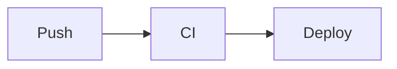

# vishine 使用文档 · USAGE

vishine 的完整使用与配置参考。视觉与交互规范见 [`DESIGN.md`](./DESIGN.md) / [`INTERACTION.md`](./INTERACTION.md) / [`MARKDOWN.md`](./MARKDOWN.md)。

> 三件「漏了就坏」的事，先记住：
> 1. `[outputs] home` 必须含 `JSON`，否则 ⌘K 搜索静默失效。
> 2. `[taxonomies]` 必须有 `tag` / `category`，否则板块色、筛选、统计都坏。
> 3. `[menu.main]` 不配则顶栏没有导航。

---

## 1. 安装与升级

环境：**Hugo extended ≥ 0.146.0**（必须 extended）。

三种安装方式：

```bash
# A. Git submodule
git submodule add https://github.com/socake/vishine.git themes/vishine
git submodule update --remote   # 升级

# B. Hugo Module（hugo.toml 配 module.imports 后）
hugo mod get -u github.com/socake/vishine   # 升级

# C. 直接克隆
git clone https://github.com/socake/vishine.git themes/vishine
```

submodule / clone 方式在 `hugo.toml` 设 `theme = "vishine"`；Module 方式用 `module.imports`。

---

## 2. 配置参考（逐项）

### 2.1 站点基础

```toml
baseURL = "https://example.org/"
title   = "我的博客"
theme   = "vishine"
enableEmoji = true
enableRobotsTXT = true
summaryLength = 30        # 自动摘要词数（无 summary frontmatter 时）
```

### 2.2 语言

```toml
defaultContentLanguage = "zh-cn"   # 必需
[languages]
  [languages.zh-cn]
    label = "简体中文"
    locale = "zh-CN"
    weight = 1
```

`locale` 用于 `og:locale` 等 meta。

### 2.3 taxonomies（必需）

```toml
[taxonomies]
  tag = "tags"
  category = "categories"
```

分类法是板块色映射、列表筛选、首页统计的基础，**不能省**。

### 2.4 outputs（必需，含 JSON）

```toml
[outputs]
  home = ["HTML", "RSS", "JSON"]
```

`JSON` 生成 `/index.json`——⌘K 命令面板 fetch 它来搜索。**漏 JSON ⇒ /index.json 404 ⇒ 搜索框打开但搜不到任何东西，且没有报错**。这是最常见的踩坑。

### 2.5 menu（必需，支持二级下拉）

一级菜单直接给 `pageRef`；二级菜单用 `identifier` 定义父项（父项不需 pageRef），子项用 `parent` 挂上去：

```toml
[menu]
  [[menu.main]]
    name = "博客"
    pageRef = "/posts"
    weight = 10

  # 父项：只做下拉容器
  [[menu.main]]
    name = "运维"
    identifier = "ops"
    weight = 40
  # 子项：parent 指向父项 identifier
  [[menu.main]]
    name = "Kubernetes"
    parent = "ops"
    pageRef = "/docs/kubernetes"
    weight = 43
```

下拉项会自动显示其指向页面的子页数量。

### 2.6 markup（必需）

render hook（标题锚点、代码块、图片、链接）依赖以下设置：

```toml
[markup]
  [markup.goldmark.renderer]
    unsafe = false                # 主题不需要 raw HTML，保持 false 更安全
  [markup.goldmark.extensions]
    strikethrough = true
    table = true
    taskList = true
    [markup.goldmark.extensions.typographer]
      disable = true              # 关掉智能引号，避免中英标点被替换
  [markup.goldmark.parser]
    autoHeadingID = true          # TOC / 锚点必需
    [markup.goldmark.parser.attribute]
      title = true                # 支持 {.class} 属性
      block = true
  [markup.highlight]
    noClasses = false             # 必需：用 CSS class 高亮，才能随 scheme 翻色
    lineNos = false
    tabWidth = 2
    guessSyntax = true
  [markup.tableOfContents]
    startLevel = 2
    endLevel = 3
    ordered = false
```

`noClasses = false` 很关键：代码高亮走 CSS 变量，三套 scheme 才能正确换色。

### 2.7 pagination

```toml
[pagination]
  pagerSize = 8     # 列表页每页条数
```

---

## 3. Params 全表

| 参数 | 作用 | 默认 | 缺失影响 |
| --- | --- | --- | --- |
| `author` | 作者名（首页 kicker / meta author） | 空 | 首页 / meta 留白 |
| `authorEn` | 作者英文名 | 空 | 首页 kicker 少一段 |
| `role` | 头衔串，按 `·` 拆成首页 role chips | 空 | 不显示 chips |
| `tagline` | 首页大标题；按中文逗号 `，` 断行，末段高亮 | 空 | 首页大标题空 |
| `description` | 站点描述（首页 lead + 默认 meta description） | 空 | 留白 |
| `defaultScheme` | 初始配色：`paper`/`clean`/`dark` | `clean` | 用 clean |
| `since` | 起始年份（统计面板 SINCE） | 空 | 留白 |
| `googleFonts` | 是否加载 Google Fonts CDN；`false` 改系统字体 | `true` | 默认走 CDN |
| `homeSections` | 首页板块顺序（section key 列表） | `["posts","playbook","docs","roadmap","resources"]` | 用默认顺序 |
| `featureZone` | 首页特色横幅（dict），见下 | 不配则不显示 | 不显示横幅 |

### featureZone 结构

```toml
[params.featureZone]
  title = "AI 专区"
  en = "AI ZONE"
  desc = "大模型 / 工具 / 应用 / AIOps 的工程化实践"
  count = "4 方向"
  [params.featureZone.lead]
    title = "AI 在帮我写脚本"
    desc = "把大模型真正接进 DevOps 工作流。"
  [[params.featureZone.cols]]
    k = "LLM"
    name = "大模型"
    desc = "推理、提示工程、模型选型与成本权衡。"
  # 可继续追加 [[params.featureZone.cols]]
```

---

## 4. 内容与板块

### 4.1 五大板块

| section 目录 | 板块 | class |
| --- | --- | --- |
| `content/posts/` | 博客 | `blog` |
| `content/playbook/` | 实战手册 | `play` |
| `content/roadmap/` | 路线图 | `road` |
| `content/docs/` | 运维文档 | `docs` |
| `content/resources/` | 资源 | `res` |

每个 section 建一个 `_index.md`（带 `title` / `description`）。`docs` 板块在首页以「分类专区」形式展示（chips = 各分类）。

### 4.2 板块色映射

颜色逻辑（见 `layouts/partials/cat-class.html`）：

1. 文章**首个分类** → 站点 `data/sections.toml` 的 `[categories]` 查表；
2. 未命中 → 文章所在 **section** 的板块 class；
3. 再兜底 → `blog`。

在**你自己站点**的 `data/sections.toml` 配映射（Hugo 深合并覆盖主题默认，主题默认为空）：

```toml
[categories]
  "Kubernetes" = "docs"
  "云原生"      = "play"
  "FinOps"     = "road"
  "大模型"      = "res"
  "故障复盘"    = "ai"
```

可选 class：`blog` / `play` / `road` / `docs` / `res` / `ai`。

> **精确匹配注意**：分类名要和 frontmatter 里写的完全一致，包括空格。`"AI工具"` 与 `"AI 工具"` 是两条不同的 key，常因此漏配导致颜色回退。

### 4.3 新增一个 section

1. 建 `content/<新section>/_index.md`；
2. 想让它进首页 bento / 用上板块色，需在主题或站点的 `data/sections.toml` 的 `[sections]` 增加对应项（`class` / `label` / `en`），并把 section key 加进 `homeSections`。否则该 section 仍可正常出列表页，只是回退到 `blog` 色、不进首页板块格。

---

## 5. Frontmatter 字段详解

| 字段 | 类型 | 说明 |
| --- | --- | --- |
| `title` | string | 标题，必填 |
| `date` | datetime | 发布时间，影响排序 / 统计 |
| `categories` | []string | 分类数组；**`index 0`（首个）决定板块色 + 自动封面配色** |
| `tags` | []string | 标签数组；卡片显示前 3 个 |
| `summary` | string | 摘要；卡片、搜索、meta description 用它。不写则取正文自动摘要 |
| `toc` | bool | `true` 显示右侧目录树 |
| `cover` | string | 手动封面 URL，优先级高于自动封面（低于 `featured.*` 资源） |
| `author` | string | 覆盖站点 `params.author` |

完整示例：

```yaml
---
title: "Nacos 一文通：配置中心与服务发现实战"
date: 2026-04-18T14:00:00+08:00
categories: ["中间件"]
tags: ["Nacos", "配置中心", "服务发现", "微服务"]
summary: "核心概念、架构原理、部署、SDK 接入、生产调优、故障排查与选型对比。"
toc: true
---
```

---

## 6. 写作元素

### 6.1 标准 Markdown

标题、列表、表格、引用、任务列表、删除线均按 `MARKDOWN.md` 的 prose 规范统一渲染（换页面不换渲染）。`##`/`###` 自动生成锚点并进 TOC。

### 6.2 Callout 提示框

```markdown

内容支持 **Markdown**。

```

`type`：`warn`（⚠️）/ `info`（💡，默认）/ `tip`（✅）。非法值回退 `info`。

### 6.3 Mermaid 图表

用围栏，主题自动渲染并随 scheme 换色，脚本 self-host（`static/js/mermaid.min.js`，不依赖外网 CDN）：

````markdown

````

### 6.4 图片 + zoom

把图放进 page bundle（文章目录里），Markdown 正常引用：

```markdown

```

render hook 自动包成 `<figure>`，可点击放大（lightbox）。超过 1280px 宽的位图自动缩放为 webp；SVG 原样用。`alt` 作图注，`title` 作放大时的描述。

### 6.5 代码复制

每个代码块右上角自动带语言标签 + 复制按钮（main.js 接管，复制后有 ✓ 反馈）。无需任何标注。

### 6.6 TOC

frontmatter `toc: true` 开启。右侧目录由 main.js 从正文 `h2/h3` 构建，含 scrollspy 高亮、折叠树、阅读宽度切换按钮。

---

## 7. 封面

> **设计理念：能自定义，也能全自动。**
> 和它的前身 Blowfish 一样，vishine 的封面**完全可自定义**——你想放什么图就放什么（page bundle 里放 `featured.*`，或 frontmatter 用 `cover` 指定 URL），主题绝不抢你的图。
> 在此之上，vishine **额外提供了一套零配置的自动生成能力**：你不配图，主题也会按「文章标题 + 分类」用 Hugo 原生能力自动渲染一张风格统一的封面。
> 即 **「想自定义就自定义，不想管就全自动」**，两者并存，你随时用自己的图覆盖自动封面，也可用 `params.cover.auto = false` 彻底关掉自动生成。

封面优先级（list / single / card 一致）：

1. **`featured.*` 资源**：page bundle 放 `featured.jpg`/`featured.png`/`featured.svg`，最优先（位图超尺寸自动缩 webp）。
2. **frontmatter `cover: "url"`**：手动指定。
3. **自动生成**：以上都没有时，`cover-svg.html` 按「标题 + 首个分类」**纯 Hugo 原生生成 SVG**（`resources.FromString` 缓存到 `/covers/`，零外部依赖、无 JS/脚本/第三方）。

### 两种规格（variant）
- **hero**（详情页横幅 1200×630）：带文章标题 + 丰富装饰。
- **thumb**（列表缩略 800×500）：无标题，大分类名 + 几何，**4 种版式据文章哈希轮换**（orbit 同心圆 / grid 点阵 / diagonal 对角 / arc 弧线），列表不重复。

### 配置 `[params.cover]`
| 参数 | 默认 | 说明 |
|---|---|---|
| `auto` | `true` | `false` = 关闭自动封面，纯靠 featured 图 |
| `style` | `"auto"` | `auto`（轮换 4 版式）｜ `orbit` ｜ `grid` ｜ `diagonal` ｜ `arc`（锁定单一版式） |
| `ignoreFeatured` | `false` | `true` = **忽略文章里的 `featured.*` 老图，全部用自动封面**。从旧主题迁移、想统一换新风格时用——不必删图，改配置即可，随时关回。 |

> **多路线下拉**：路线图 / 文档这类"一个 section 下多个子页"，把顶栏菜单项配成 `identifier`（父，无 `pageRef`）+ 多个 `parent = "<id>"` 的子项（见 `[menu.main]`），即得到和「运维 / AI」一样的顶栏下拉。每个子页是独立文章页（带 TOC 导航），避免长内容挤在一页。

### 着色与字号
- 板块色查 `data/sections.toml`（首个分类 → 板块 class → 色），无分类回退 section、兜底 `blog`。
- 字号按**视觉宽度**计（中文≈1 / 英文≈0.55），不同分类名字号视觉一致；标题（hero）超 11 字按 rune 安全断两行。

### 自定义 / 扩展
- **换配色**：改 `data/sections.toml` 的分类映射 + `cover-svg.html` 顶部 `$pal`/`$palD`/`$palB` 三组调色板。
- **加新版式**：在 `cover-svg.html` 的 thumb 分支加一段 `{{ else if eq $seed 4 }}…几何…{{ end }}`，并把版式选择的 `mod … 4` 改成 `5`。
- **改横幅风格**：改 hero 分支。

---

## 8. 三套 scheme

| scheme | 名称 | 适用 |
| --- | --- | --- |
| `paper` | 暖纸 | 暖色护眼 |
| `clean` | 纯白 | 默认，干净 |
| `dark` | 暗色 | 暗环境 |

- **切换**：顶栏右侧三个色块按钮。
- **默认**：`params.defaultScheme`（默认 `clean`），写在 `<html data-scheme>`。
- **持久化**：存 `localStorage` 的 `vishine-scheme`；渲染前由 `head-scheme.html` 内联脚本读取并应用，无白屏闪烁。阅读宽度同理存 `vishine-readwidth`（`comfortable`/`wide`）。
- **自定义 token**：三套 scheme 的颜色变量（`--c-blog`、`--ink-*`、`--code-*` 等）在 `assets/css/` 定义，按 `data-scheme` 切换。新增 / 改色规则见 `DESIGN.md`，务必三套各验一遍。

---

## 9. 自定义进阶

- **板块色**：改 `data/sections.toml`（映射）+ `assets/css` 的 `--c-*` token（实际色值）。
- **字体**：`googleFonts = false` 关 CDN，改用 `Noto Sans SC` / `JetBrains Mono` 的系统回退栈。也可自托管字体后改 `head.html`。
- **favicon**：替换 `static/favicon.svg`。
- **菜单**：见 §2.5，支持二级下拉。
- **首页板块顺序 / 特色横幅**：`homeSections` / `featureZone`（§3）。

---

## 10. 搜索（⌘K）

- 快捷键 `⌘K` / `Ctrl+K`，或点顶栏「搜索…」。
- 数据源 `/index.json`，由 home 的 JSON output 生成，每个 RegularPage 一项（title / url / section / summary / categories / tags / date）。
- **前提**：`[outputs] home` 含 `"JSON"`。漏掉则索引 404、搜索无结果且无报错。

---

## 11. 部署与排坑

- **GitHub Pages（Project Pages，子路径）**：`baseURL = "https://<user>.github.io/<repo>/"`。主题已用 `relURL` 处理 Mermaid 脚本路径（`window.VISHINE_MERMAID_SRC`），子路径下能正常加载；资源走 Hugo pipeline 也自动带前缀。
- **生产构建**：`hugo --minify`。生产模式下 CSS/JS 自动 concat + minify + fingerprint + 注入 SRI integrity。
- **Google Fonts 国内慢 / 被墙**：`params.googleFonts = false`，回退系统字体。
- **Mermaid 不显示**：确认 `static/js/mermaid.min.js` 存在、`baseURL` 子路径正确。

---

## 12. FAQ：页面空白 / 异常排查

| 现象 | 排查 |
| --- | --- |
| ⌘K 搜索打开但搜不到东西 | `[outputs] home` 漏了 `"JSON"`，访问 `/index.json` 看是否 404 |
| 顶栏没有导航 | 没配 `[menu.main]` |
| 卡片 / 标签颜色不对、都灰扑扑 | `data/sections.toml` 的 `[categories]` 分类名没**精确匹配**（空格、大小写），或没在站点侧配映射 |
| 代码高亮三套 scheme 不换色 | `[markup.highlight] noClasses` 不是 `false` |
| 标题没锚点 / TOC 空 | `[markup.goldmark.parser] autoHeadingID` 没开，或文章 `toc: false` |
| 首页大标题 / 头衔 chips 空 | 没配 `params.tagline` / `params.role` |
| 构建报资源处理错误 | 用的不是 Hugo **extended** 版本 |
| 首页某板块缺失 | `homeSections` 里没列该 section，或 `data/sections.toml [sections]` 缺对应项 |
