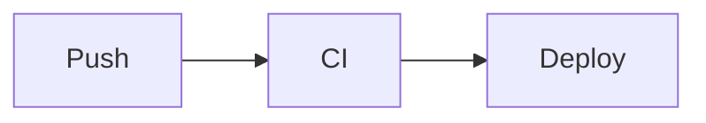
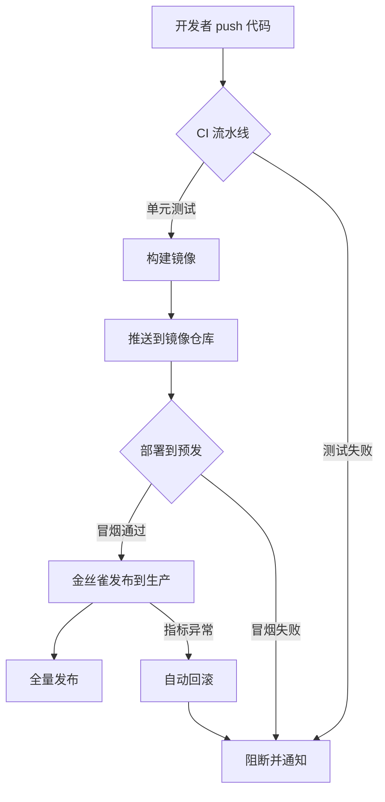


不用装插件、不引外网 CDN —— 在 Markdown 里用一个围栏写 Mermaid，vishine 自托管脚本会渲染它，还会跟着 scheme 一起翻色。


## 一、怎么用

写一个语言标为 `mermaid` 的代码围栏即可：

````markdown

````

主题会在页面加载时自动找到这些围栏并渲染成图。


Mermaid 脚本是**自托管**的（`static/js/mermaid.min.js`），不依赖任何外网 CDN。国内访问、内网部署都能正常出图。


## 二、真实示例：一次发布的流程

下面是一个真正会被渲染出来的流程图（点顶栏色块切换 scheme，图的配色会跟着变）：



## 三、随配色翻色

vishine 给 Mermaid 注入了跟随 `data-scheme` 的主题变量，所以：

- 在 **clean** 下是浅底深线；
- 切到 **dark** 下自动变深底浅线；
- **paper** 下走暖色调。


不用为每套 scheme 各画一张图。同一段 Mermaid 代码，主题会在切换配色时重渲染成对应色调 —— 在本页直接点顶栏色块试试。


## 四、支持的图类型

Mermaid 的常见图都能用，几个高频的：

| 类型 | 围栏首行 | 用途 |
| --- | --- | --- |
| 流程图 | `flowchart TD` / `graph LR` | 流程、决策 |
| 时序图 | `sequenceDiagram` | 服务调用、交互 |
| 状态图 | `stateDiagram-v2` | 状态机 |
| 甘特图 | `gantt` | 计划排期 |
| 类图 | `classDiagram` | 数据结构 |


**子路径部署**（GitHub Project Pages）下若 Mermaid 不显示：确认 `static/js/mermaid.min.js` 存在，且 `baseURL` 的子路径写对了。主题已用 `relURL` 处理脚本路径，路径正确就能加载。


下一步：[菜单与多级下拉](../menus/) —— 配顶栏导航。
