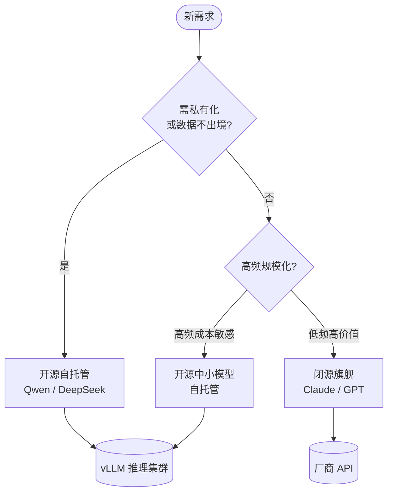

选型不是"哪个榜分高用哪个"。同一个需求，选错模型轻则烧钱，重则数据出境违规。先把维度理清楚。

## 选型的六个维度

- **能力**：推理、代码、长文本理解、多语言，分场景看，别只看综合榜
- **上下文窗口**：RAG / 长文档场景直接决定可用性，128K 和 1M 是两个世界
- **价格**：按输入 / 输出 token 分别计费，输出通常贵 3-5 倍
- **延迟**：首 token 延迟（TTFT）和吞吐，对话和批处理要求完全不同
- **数据合规**：是否出境、是否可签 DPA、能否关闭训练数据回流
- **可私有化**：金融 / 政企往往强制内网部署，这条直接砍掉闭源

> 经验法则：先用合规和私有化做硬性筛选，再在剩下的候选里比能力和成本。顺序反了会白忙活。

按这个顺序走，决策路径其实很清晰：



## 闭源 vs 开源对比

| 维度 | 闭源 (GPT / Claude / Gemini) | 开源 (Llama / Qwen / DeepSeek) |
| --- | --- | --- |
| 顶级能力 | 强，前沿基本领先半代 | 追赶快，旗舰已接近 |
| 上下文窗口 | 大，Gemini 可到 1M+ | 中到大，Qwen / DeepSeek 已支持长上下文 |
| 价格 | 按 token 付费，量大成本高 | 自托管后边际成本趋近算力电费 |
| 数据合规 | 依赖厂商条款，出境是痛点 | 可完全内网，数据不出门 |
| 私有化 | 基本不行（少数企业版除外） | 原生支持，权重可下载 |
| 运维负担 | 几乎为零 | 需自建推理集群、做量化和扩缩容 |

## 不同场景推荐

1. **C 端高质量对话 / 复杂推理**：优先闭源旗舰（Claude、GPT），省去自建运维
2. **企业内网 / 数据敏感**：Qwen、DeepSeek 私有化部署，配合 vLLM 做推理
3. **高并发、成本敏感的简单任务**（分类、抽取、改写）：开源中小模型自托管最划算
4. **长文档 RAG**：看上下文窗口和检索配合，闭源长窗口或开源长上下文模型都可

## 成本估算

闭源按 token 估算，假设输入输出 1:1，月调用 1000 万 token：

```text
月成本 ≈ (输入 token × 输入单价 + 输出 token × 输出单价)
       = 5M × $3/M + 5M × $15/M  ≈ $90 / 月（示例单价）
```

开源自托管要算的是 GPU 折旧 + 电费 + 运维人力：

```text
一张推理卡按 7×24 跑满，月成本 = 卡租金 + 电费
量越大，单 token 成本越低，存在一个"自托管划算"的盈亏平衡点
```

结论：**低频高价值用闭源，高频规模化且数据敏感用开源**，多数团队最终是混合架构——用闭源跑难任务、开源兜底量大的简单任务。
