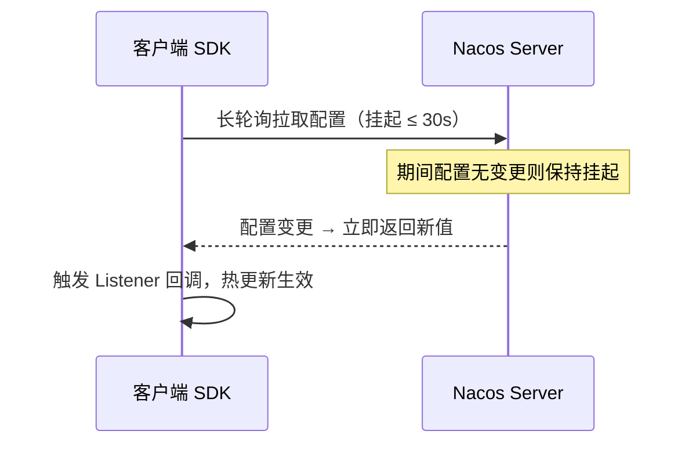

我们这套系统的配置中心和服务发现都跑在 Nacos 上，接手了两年多。真正把它从"能跑"用到"放心扛生产"中间踩过的坑不少——鉴权、密码漂移、临时实例健康检查、长轮询卡住、集群同步失败。这篇把概念、部署、SDK 接入、运维踩坑、选型对比一起整理下来，基于 Nacos 2.x。

## 一、Nacos 是什么

Nacos 全称 **Dynamic Naming And Configuration Service**，名字直接说明它做两件事：

1. **Naming** —— 服务注册与发现（替代 Eureka、Consul 的部分职责）
2. **Configuration** —— 动态配置中心（替代 Spring Cloud Config、Apollo）

> 一句话：Nacos 同时承担配置中心和服务发现两个核心职责，是 Spring Cloud Alibaba 生态的基石。

## 二、架构与一致性

Nacos 内部用两套一致性协议分别服务两类数据：

- 临时实例（健康检查驱动）走 **Distro 协议**（AP，最终一致）
- 持久化实例与配置走 **Raft 协议**（CP，强一致）

、Raft 管持久数据(CP)，客户端经 gRPC 长连接接入，配置与元数据持久化到外置 MySQL")

### 2.1 为什么要分两套

临时实例数量大、变化频繁，用 AP 保证可用性；配置和持久数据要求强一致，用 CP。行内的 `instance.ephemeral` 字段决定走哪条路。

配置热更新的长轮询流程，用 Mermaid 几行文本就能画出来（不用手画 SVG）：



## 三、部署上线

下面是一份**带鉴权**的单机 `docker-compose.yml`，注意 `NACOS_AUTH_TOKEN` 必须不少于 32 字节的 Base64 串：

```yaml
version: "3.8"
services:
  nacos:
    image: nacos/nacos-server:v2.3.2
    container_name: nacos
    environment:
      MODE: standalone          # 单机；生产改 cluster
      NACOS_AUTH_ENABLE: "true"  # 2.x 必须显式开启鉴权
      NACOS_AUTH_TOKEN: "VGhpc0lzQVZlcnlMb25nUmFuZG9tU2VjcmV0S2V5"
    ports:
      - "8848:8848"   # 主端口：控制台 / OpenAPI
      - "9848:9848"   # gRPC，2.x 新增，务必放行
    volumes:
      - ./data:/home/nacos/data
```


2.x 必须显式开启鉴权，否则空口令可被接管。`9848` gRPC 端口是 2.x 新增的，安全组/防火墙只放 8848 是最经典的坑——客户端注册成功但调不到服务，长连接反复重连。


## 四、SDK 接入

原生 SDK 拿配置并注册监听，变更回调底层就是长轮询驱动的：

```java
ConfigService configService = NacosFactory.createConfigService(props);
String content = configService.getConfig(dataId, group, 5000L);
configService.addListener(dataId, group, new Listener() {
    public void receiveConfigInfo(String cfg) { reload(cfg); }
    public Executor getExecutor() { return null; }
});
```

## 五、选型对比

| 维度 | Nacos | Apollo | Consul | etcd |
|---|---|---|---|---|
| 配置中心 | ✓ | ✓ | △ | △ |
| 服务发现 | ✓ | ✗ | ✓ | △ |
| 一致性 | AP+CP | — | CP | CP |
| 上手成本 | 低 | 中 | 中 | 高 |

## 六、小结

Nacos 适合 Spring Cloud Alibaba 体系下"配置 + 注册发现"一站式诉求。生产上最该盯的是：鉴权务必开、`9848` 务必放行、临时实例健康检查阈值要调、集群脑裂要有预案。
