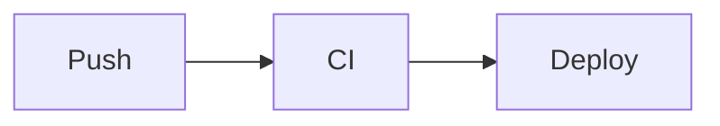
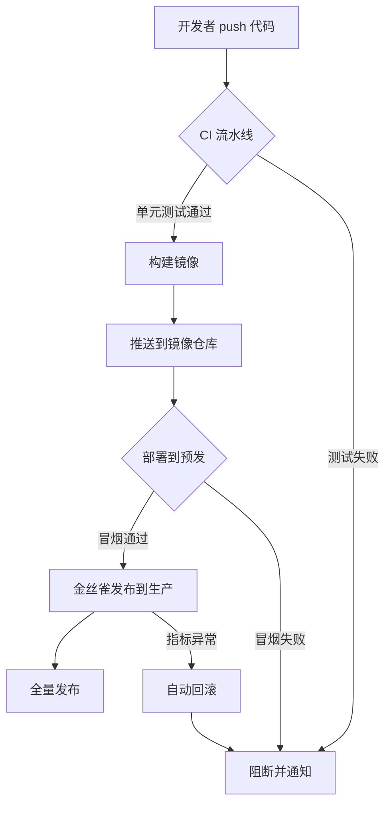
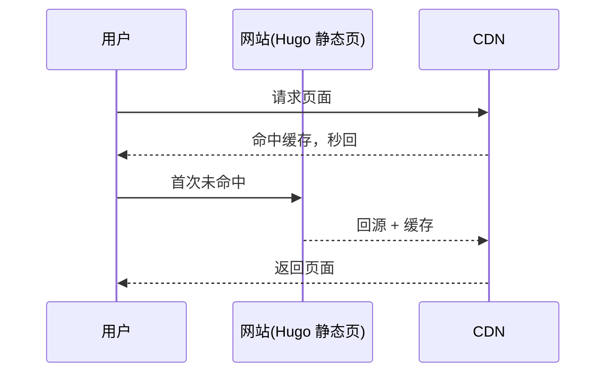


不用装插件、不引外网 CDN —— 在 Markdown 里用一个代码围栏写 Mermaid，vishine 的自托管脚本会把它渲染成图，还会跟着配色方案一起翻色。


## 一、怎么用

**Mermaid** 是一种「用文字描述图表」的语法：你写几行文本说明节点和连线，它自动画成流程图、时序图等。在 vishine 里，只要写一个语言标为 `mermaid` 的代码围栏即可：

````markdown

````

主题会在页面加载时自动找到这些围栏，渲染成图。


Mermaid 脚本是**自托管**的（随主题分发的 `static/js/mermaid.min.js`），不依赖任何外网 CDN。国内访问、内网部署都能正常出图。


## 二、真实示例：一次发布的流程

下面是一个真正会被渲染出来的流程图（点顶栏色块切换配色，图会跟着翻色）：



## 三、再来一个：时序图



## 四、随配色翻色

vishine 给 Mermaid 注入了跟随 `data-scheme` 的主题变量，所以：

- 在 **clean** 下是浅底深线；
- 切到 **dark** 自动变深底浅线；
- **paper** 下走暖色调。


不用为每套配色各画一张图。同一段 Mermaid 代码，主题会在切换配色时重新渲染成对应色调 —— 在本页直接点顶栏色块试试。


## 五、支持的常见图类型

| 类型 | 围栏首行 | 用途 |
| --- | --- | --- |
| 流程图 | `flowchart TD` / `graph LR` | 流程、决策 |
| 时序图 | `sequenceDiagram` | 服务调用、交互 |
| 状态图 | `stateDiagram-v2` | 状态机 |
| 甘特图 | `gantt` | 计划排期 |
| 类图 | `classDiagram` | 数据结构 |


**子路径部署**（GitHub 项目站点，见 [09 章](../09-deploy/)）下若 Mermaid 不显示：确认 `static/js/mermaid.min.js` 存在，且 `baseURL` 的子路径写对了。



会画图了。下一章 **[08 · 菜单与多级下拉](../08-menus/)** 教你把顶栏导航配出二级下拉，就像本教程顶栏那样。

